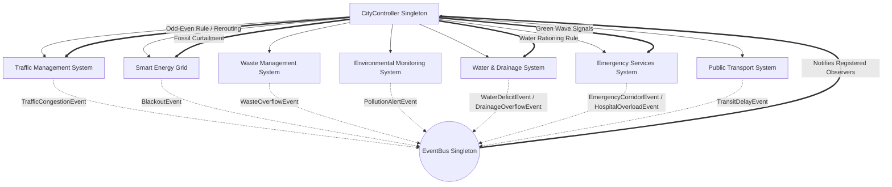

# 🌆 Mini Smart City Simulator

An advanced, object-oriented discrete-event simulation of an urban smart city ecosystem featuring **7 interacting municipal subsystems**, event-driven reactive policies, design patterns, multi-threaded event pipelines, data logging, automated visualization, and multiple user interfaces (**CLI**, **Desktop Tkinter GUI**, and **Glassmorphic Web Dashboard**).

---

## 📋 Table of Contents

- [Overview](#-overview)
- [Key Features](#-key-features)
- [Architecture & 7 Urban Subsystems](#-architecture--7-urban-subsystems)
- [Design Patterns & Advanced Python Concepts](#-design-patterns--advanced-python-concepts)
- [Emergent Behaviors & Feedback Loops](#-emergent-behaviors--feedback-loops)
- [Project Structure](#-project-structure)
- [Installation & Setup](#-installation--setup)
- [Running the Simulator](#-running-the-simulator)
  - [1. Modern Web Dashboard](#1-modern-web-dashboard-recommended)
  - [2. Interactive Desktop GUI](#2-interactive-desktop-gui)
  - [3. Command-Line Interface (CLI)](#3-command-line-interface-cli)
  - [4. Multithreaded Subsystem Engine](#4-multithreaded-subsystem-engine-co-5)
- [CLI Options Reference](#-cli-options-reference)
- [Data Logging & Analytics](#-data-logging--analytics)
- [Running Unit Tests](#-running-unit-tests)
- [Extending the Simulator](#-extending-the-simulator)
- [License](#-license)

---

## 🏙️ Overview

The **Mini Smart City Simulator** models a municipal urban environment across discrete time steps (simulated hours). City dynamics fluctuate through realistic diurnal human activity curves (morning and evening traffic rush hours, peak commercial energy consumption, daily waste generation, and variable weather/rainfall).

A central **City Controller** orchestrates the simulation lifecycle, listens to municipal incidents emitted via a thread-safe **Observer EventBus**, and dynamically enacts smart policies to resolve crises in real time (such as odd-even vehicle restrictions during severe smog, power plant curtailment, water rationing during reservoir droughts, and emergency green-wave traffic corridors).

---

## ✨ Key Features

- **7 Integrated Subsystems**: Traffic, Energy Grid, Waste Management, Environment Monitoring, Water & Drainage, Emergency Services, and Public Transport.
- **Multiple Interfaces**:
  - 🌐 **Glassmorphic Web Dashboard**: Real-time browser telemetry, interactive gauges, zone status cards, and live chart streams powered by a built-in Python HTTP & REST API server.
  - 🖥️ **Desktop Tkinter GUI**: Standalone interactive application with step-by-step stepping, automated play/pause, policy toggles, and embedded Matplotlib visualizer.
  - 💻 **CLI Mode**: Fast batch execution with rich terminal output, structured CSV/JSON data logging, and automated high-resolution analytics generation.
- **Advanced OOP & Design Patterns**: Singleton, Observer, Strategy, Iterator Protocol, Abstract Base Classes, and Type-safe Dataclasses.
- **Concurrency & Stream Processing**:
  - Python generator functions (`yield`) for on-demand event streaming.
  - Custom Iterator protocol (`__iter__`, `__next__`) and fluent `EventPipeline` processing.
  - Concurrent multithreaded engine utilizing `threading.Thread` producer workers and thread-safe `queue.Queue`.
- **Comprehensive Test Suite**: 24 automated unit tests validating state machines, load balancing, policy lifecycles, and edge cases.

---

## 🏛️ Architecture & 7 Urban Subsystems

All subsystems inherit from the polymorphic abstract interface `BaseSubsystem` (`abc.ABC`), guaranteeing consistent lifecycle methods (`update(step)`, `get_status()`, `reset()`):



### 1. Traffic Management Subsystem (`city/traffic.py`)
- **Network Model**: Models municipal zones interconnected by arterial boulevards, local ring roads (`Road`), and signalized junctions (`Intersection`).
- **Signal State Machine**: Traffic signals cycle dynamically through `GREEN -> YELLOW -> RED -> GREEN` based on configurable step intervals.
- **Strategy-Based Rerouting**:
  - `StaticRoutingStrategy`: Standard routing along primary routes.
  - `DynamicCongestionReroutingStrategy`: Monitors road saturation; when congestion exceeds 70%, vehicles dynamically divert to secondary bypass roads.
- **Odd-Even Policy**: Restricts commuter vehicle volume by license plate parity during pollution emergencies (~50% reduction).

### 2. Smart Energy Grid Subsystem (`city/energy.py`)
- **Generation Mix**: Models clean renewable assets (Solar Farms, Wind Turbines) and non-renewable conventional assets (Natural Gas Peakers, Coal).
- **Diurnal Load Curve**: Computes residential and commercial building power demand based on time-of-day peak curves.
- **Merit-Order Load Balancing**: Prioritizes green renewable power first, dispatching conventional plants only to meet deficits.
- **Blackout Simulation**: Fires `BlackoutEvent` if total demand outstrips available capacity or when plants are curtailed.

### 3. Waste Management Subsystem (`city/waste.py`)
- **Municipal Generation**: Computes refuse generation per zone proportional to active population and commercial activity.
- **Smart Bins**: Smart `WasteBin` units monitor real-time fill percentages.
- **Fleet Collection Routing**: `GarbageTruck` units continuously traverse multi-zone routes, emptying full bins and unloading at depots.
- **Overflow Alerting**: Emits `WasteOverflowEvent` when bins reach maximum capacity before collection.

### 4. Environmental Monitoring Subsystem (`city/environment.py`)
- **Air Quality Index (AQI)**: Dynamically computes citywide AQI from vehicular traffic, congestion idling emissions, and fossil-fuel plant output.
- **Severity Categories**: Categorizes AQI into `GOOD`, `MODERATE`, `UNHEALTHY` (AQI ≥ 110), and `HAZARDOUS`.
- **Threshold Triggers**: Emits `PollutionAlertEvent` to initiate citywide restrictions and resets them when AQI clears (< 80).

### 5. Smart Water & Drainage Subsystem (`city/water.py`)
- **Reservoirs & Diurnal Demand**: Tracks reservoir storage against residential morning/evening consumption curves.
- **Stormwater & Drainage**: Simulates weather events and stormwater runoff managed by `DrainagePumpStation` units.
- **Crisis Alerts**: Emits `WaterDeficitEvent` when reservoir reserves fall below 20%, and `DrainageOverflowEvent` during flood surges.
- **Rationing Policy**: Implements municipal water rationing (~35% demand reduction) during drought conditions.

### 6. Emergency Services Subsystem (`city/emergency.py`)
- **Incident Dispatch**: Simulates medical, fire, and police incidents with varying severity (`LOW`, `MEDIUM`, `HIGH`, `CRITICAL`).
- **Dynamic Response Times**: Response times scale dynamically with road congestion.
- **Green-Wave Corridor**: Emits `EmergencyCorridorEvent` to clear signals and lower ambulance transit times during heavy traffic.
- **Hospital Overload Tracking**: Tracks ICU and general ward occupancies, publishing `HospitalOverloadEvent` when hospitals hit capacity.

### 7. Public Transport Subsystem (`city/transit.py`)
- **Multi-Modal Transit**: Simulates bus and metro routes across city zones with headway tracking and commuter capacity.
- **Traffic Interdependence**: Bus route speeds dynamically degrade under arterial road congestion, causing transit delays.
- **Delay Alerting**: Emits `TransitDelayEvent` to prompt schedule rebalancing and public commuter advisories.

---

## 🎯 Design Patterns & Advanced Python Concepts

| Concept / Pattern | Implementation Files | Educational & Architectural Purpose |
|---|---|---|
| **Singleton Pattern** | `city/controller.py`, `city/event_bus.py` | Guarantees a single central orchestrator and global message bus with thread-safe `__new__` locking and test reset helpers. |
| **Observer Pattern** | `city/event_bus.py`, Subsystems | Fully decouples event producers from consumers via subscription-based message passing. |
| **Strategy Pattern** | `city/traffic.py` | Encapsulates vehicle navigation logic into interchangeable `TrafficRoutingStrategy` concrete classes (`Static` vs `DynamicCongestionRerouting`). |
| **Abstract Base Classes** | `city/base.py` (`abc.ABC`) | Enforces uniform polymorphism (`update`, `get_status`, `reset`) across all 7 urban subsystems. |
| **Type-Safe Data Classes** | All `city/*.py` | Leverages `@dataclass` for clean domain entities (`Zone`, `Road`, `Vehicle`, `PowerPlant`, `WasteBin`, `Hospital`, `TransitRoute`). |
| **Custom Exception Hierarchy** | `exceptions.py` | Domain-specific exception handling (`SmartCityError`, `ZeroPopulationZoneError`, `InvalidConfigError`). |
| **Python Generators (`yield`)** | `city/concurrency.py` | Stream subsystem event snapshots lazily step-by-step without upfront memory overhead. |
| **Custom Iterator Protocol** | `city/concurrency.py` | Implements `__iter__` and `__next__` on `EventStreamIterator` with chained fluent filtering (`EventPipeline`). |
| **Multithreading & Safe Queue** | `city/concurrency.py` | Runs 6 subsystem producer threads (`threading.Thread`) feeding events into a thread-safe `queue.Queue`. |

---

## ⚡ Emergent Behaviors & Feedback Loops

An **emergent behavior** is a system-wide phenomenon resulting from decentralized local interactions among independent subsystems:

```text
[Feedback Loop 1: Pollution Emergency]
High Traffic & Peaker Power Output
       │
       ▼
Smokestack & Exhaust Emissions Spike AQI > 110 (UNHEALTHY)
       │
       ▼
EnvironmentMonitor emits PollutionAlertEvent
       │
       ▼
CityController enacts Odd-Even Restriction & Fossil Plant Curtailment
       │
       ▼
Traffic cuts by ~50% & emissions fall -> AQI drops < 80 -> Policies lift automatically

──────────────────────────────────────────────────────────────────────────

[Feedback Loop 2: Water Scarcity & Rationing]
Prolonged Urban Demand Drops Reservoir Level < 20%
       │
       ▼
WaterManagementSystem emits WaterDeficitEvent
       │
       ▼
CityController activates Municipal Water Rationing Policy
       │
       ▼
Per-capita water demand cut by 35% -> Reservoir stabilizes

──────────────────────────────────────────────────────────────────────────

[Feedback Loop 3: Congestion & Emergency Corridor]
Peak Rush-Hour Traffic Causes Arterial Saturation > 80%
       │
       ▼
Ambulance & Transit Response Times Degrade
       │
       ▼
Emergency Services activates Green-Wave Signal Corridor & Dynamic Bypass Rerouting
       │
       ▼
Emergency response times recover despite heavy background city traffic
```

---

## 📂 Project Structure

```text
Python_MiniProject/
├── run.py                               # Top-level quickstart runner
└── appminiproject/
    ├── pyproject.toml                   # Project metadata and pytest configuration
    ├── requirements.txt                 # Project dependencies
    ├── README.md                        # Primary documentation
    ├── VIVA_GUIDE.md                    # Viva Voce & college evaluation guide
    └── smart_city_simulator/
        ├── __init__.py                  # Package root
        ├── main.py                      # CLI entry point (argparse)
        ├── gui.py                       # Interactive Tkinter desktop dashboard
        ├── web_server.py                # Built-in HTTP server & REST API
        ├── exceptions.py                # Custom exception hierarchy
        ├── city/
        │   ├── __init__.py              # Subsystem exports
        │   ├── base.py                  # Abstract BaseSubsystem interface
        │   ├── controller.py            # CityController (Singleton orchestrator)
        │   ├── event_bus.py             # EventBus (Observer pattern)
        │   ├── traffic.py               # Traffic & Strategy pattern rerouting
        │   ├── energy.py                # Power plants & merit-order load balancing
        │   ├── waste.py                 # Smart bins & garbage truck routes
        │   ├── environment.py           # AQI computation & pollution alerts
        │   ├── water.py                 # Reservoirs, drainage pumps & rationing
        │   ├── emergency.py             # Hospitals, dispatch & green-wave corridors
        │   ├── transit.py               # Bus/metro routes & delay tracking
        │   └── concurrency.py           # Generators, Iterators & Threaded workers
        ├── utils/
        │   ├── __init__.py
        │   ├── logger.py                # CSV & JSON-lines simulation loggers
        │   └── visualizer.py            # Matplotlib 3-panel analytics dashboard
        ├── web/                         # Glassmorphic web frontend
        │   ├── index.html               # Web dashboard single-page interface
        │   ├── css/style.css            # Dark glassmorphism styling
        │   └── js/app.js                # Live telemetry charts & API client
        ├── tests/
        │   ├── __init__.py
        │   └── test_subsystems.py       # 24 comprehensive pytest unit tests
        └── data/
            ├── simulation_log.csv       # Recorded CSV metrics per step
            ├── simulation_log.json      # Recorded JSON lines snapshots
            └── simulation_results.png   # Generated high-resolution dashboard plot
```

---

## 🛠️ Installation & Setup

### Prerequisites
- **Python 3.9+** (Tested on Python 3.9, 3.10, 3.11, 3.12, 3.13)
- No heavy external frameworks required! Only `matplotlib` (for visual plots) and `pytest` (for unit testing).

### Setup Instructions

```bash
# 1. Clone or navigate to the repository root
cd Python_MiniProject

# 2. (Optional) Create and activate a virtual environment
# On Windows:
python -m venv venv
venv\Scripts\activate

# On macOS/Linux:
python3 -m venv venv
source venv/bin/activate

# 3. Install dependencies
pip install -r appminiproject/requirements.txt
```

---

## 🚀 Running the Simulator

You can launch the simulator using either the root runner `run.py` or the module runner `python -m smart_city_simulator.main`.

### 1. Modern Web Dashboard (Recommended)

Launch the glassmorphic web dashboard in your browser with real-time controls, telemetry cards, live charts, and policy toggles:

```bash
# From repository root:
python run.py --web

# Or specify a custom port / zone count:
python run.py --web --port 8080 --zones 4
```

Then open your browser to: **`http://localhost:8000`**

---

### 2. Interactive Desktop GUI

Launch the desktop GUI dashboard built with native Python Tkinter:

```bash
# From repository root:
python run.py --gui
```

Features:
- Live metric counters (Congestion, Energy Supply/Demand, AQI, Water Reserves, Emergency Response).
- Single-step and continuous simulation play/pause controls.
- Interactive policy overrides (Odd-Even Rule, Power Curtailment, Water Rationing, Green Wave).
- Embedded live-updating Matplotlib charts.

---

### 3. Command-Line Interface (CLI)

Run high-speed batch simulations with structured console output, CSV/JSON logging, and dashboard plot generation:

```bash
# Run 48 simulated hours across 3 zones with reproducible random seed
python run.py --steps 48 --zones 3 --seed 42 --save-only

# Run a 72-hour simulation with uniform zone population of 2,000 residents
python run.py --steps 72 --zones 4 --zone-pop 2000 --save-only
```

Sample CLI output:
```text
=======================================================
🚀 Starting Mini Smart City Simulator (48 steps, 3 zones)
=======================================================

[Step 18] ⚠️ EMERGENT POLICY ACTIVATION: AQI reached 121.9 (UNHEALTHY). Activated 'Odd-Even Vehicle Restriction' & 'Fossil Power Curtailment'.
[Step 19] ⚡ CRITICAL: Grid Blackout at step 19! Deficit=2.09 MW.
[Step 20] ⚡ CRITICAL: Grid Blackout at step 20! Deficit=2.17 MW.
[Step 23] 🍃 POLICY DEACTIVATION: AQI returned to safe levels (76.5). Lifted 'Odd-Even Vehicle Restriction'.

✅ Simulation successfully finished.

📁 Log files generated:
   • CSV: appminiproject/smart_city_simulator/data/simulation_log.csv
   • JSON: appminiproject/smart_city_simulator/data/simulation_log.json
📊 Visualization dashboard saved to: appminiproject/smart_city_simulator/data/simulation_results.png
```

---

### 4. Multithreaded Subsystem Engine

Execute concurrent subsystem workers communicating asynchronously via thread-safe queues:

```bash
python run.py --steps 24 --threaded
```

---

## ⚙️ CLI Options Reference

| Option | Type | Default | Description |
|---|---|---|---|
| `--steps` | `int` | `48` | Number of simulation steps (each step = 1 simulated hour). |
| `--zones` | `int` | `3` | Number of municipal city zones to simulate. |
| `--seed` | `int` | `None` | Seed for reproducible random distributions. |
| `--zone-pop` | `int` | `None` | Uniform baseline population for each zone (e.g. `2000`). |
| `--alert-threshold` | `float` | `110.0` | AQI threshold that triggers emergency municipal restrictions. |
| `--web` | `flag` | `False` | Launches the modern glassmorphic web browser dashboard. |
| `--port` | `int` | `8000` | HTTP port for the web server when `--web` is enabled. |
| `--gui` | `flag` | `False` | Launches the interactive Tkinter desktop GUI. |
| `--threaded` | `flag` | `False` | Runs concurrent subsystem worker threads with a safe `Queue`. |
| `--save-only` | `flag` | `False` | Saves the chart directly to PNG without opening a window. |
| `--no-plot` | `flag` | `False` | Disables Matplotlib dashboard plot generation. |

---

## 📊 Data Logging & Analytics

### Output Files (`smart_city_simulator/data/`)

1. **`simulation_log.csv`**: Full step-by-step metrics tabular log including:
   - `traffic_congestion`, `total_vehicles`, `rerouted_vehicles`, `odd_even_active`, `green_wave_active`
   - `energy_usage`, `energy_supply`, `renewable_mw`, `non_renewable_mw`, `emissions_kg`, `blackout`
   - `total_waste_kg`, `collected_waste_kg`, `overflow_bins`
   - `aqi`, `high_pollution`, `severity`
   - `water_consumption_kl`, `water_demand_kl`, `reservoir_level_pct`, `avg_drainage_load_pct`, `water_rationing_active`
   - `emergency_incidents`, `critical_incidents`, `avg_response_time_min`, `avg_hospital_occupancy`
2. **`simulation_log.json`**: Line-delimited JSON objects for streaming analytics or external dashboard ingestion.
3. **`simulation_results.png`**: High-resolution 3-panel analytics dashboard displaying:
   - **Panel 1 (Traffic)**: Average congestion curve, vehicle counts, and shaded Odd-Even activation periods.
   - **Panel 2 (Energy Grid)**: Demand vs Supply curves, renewable generation share, and blackout deficit markers.
   - **Panel 3 (Environment)**: AQI trajectory, alert threshold (110 AQI), safe threshold (80 AQI), and emergency policy shaded windows.

---

## 🧪 Running Unit Tests

The test suite covers all subsystems, design patterns, event lifecycles, and concurrency components:

```bash
# Run all unit tests from the appminiproject directory:
cd appminiproject
pytest -v
```

### 24 Unit Tests Overview

- **Traffic Tests**: Zero-population validation, 4-phase traffic light state machine, odd-even restriction filtering, Strategy Pattern runtime algorithm swapping.
- **Energy Grid Tests**: Merit-order renewable prioritization, non-renewable curtailment policy, blackout event triggering.
- **Waste Management Tests**: Garbage truck collection cycles and bin overflow events.
- **Environment & Observer Tests**: Multi-source AQI computation, alert threshold crossing, and observer notifications.
- **Water & Drainage Tests**: Diurnal consumption, water rationing policy, reservoir deficit alerts, drainage pump saturation.
- **Emergency Services Tests**: Congestion-dependent response times, green-wave corridor improvements, hospital bed/ICU tracking.
- **Controller & Policy Tests**: Emergent policy lifecycles (smog response and water rationing), configuration validation, logger output integrity.
- **Transit Tests**: Public transit congestion delay scaling and delay event emissions.
- **Generators & Iterators (CO-3/CO-4)**: Event generation with `yield`, custom iterator protocol (`__iter__`, `__next__`), and fluent pipeline filtering (`take`, `filter_subsystem`).
- **Multithreading (CO-5)**: Producer worker threads (`threading.Thread`) and thread-safe queue draining (`queue.Queue`).

---

## 💡 Extending the Simulator

The modular architecture makes adding new urban features straightforward:

1. **Add a Subsystem**: Subclass `BaseSubsystem` (`smart_city_simulator/city/base.py`) and implement `update()`, `get_status()`, and `reset()`.
2. **Define Custom Events**: Create subclasses of `Event` in `smart_city_simulator/city/event_bus.py`.
3. **Register Policies**: Subscribe to new events in `CityController` (`smart_city_simulator/city/controller.py`) and add reactive policy logic.
4. **Expose Metrics**: Add new metrics to `SimulationLogger` and the Web/GUI dashboards.

---

## 📜 License

This project is licensed under the **MIT License** — suitable for academic submissions, coursework demonstrations, and advanced Python portfolio showcases.
