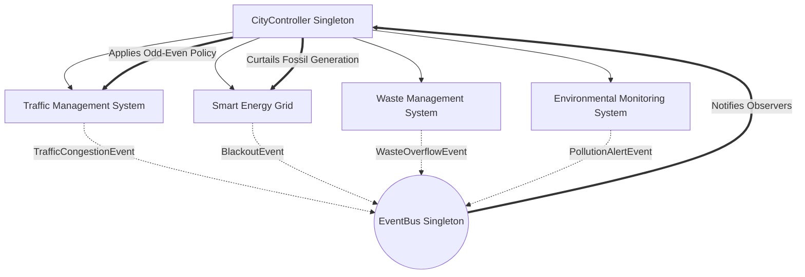

# 🌆 Mini Smart City Simulator

An advanced, object-oriented discrete-event simulation of an urban smart city ecosystem featuring interacting subsystems, event-driven reactive policies, design patterns, data logging, and automated visualization.

---

## 📋 Table of Contents

- [Overview](#overview)
- [Architecture & Subsystems](#architecture--subsystems)
- [Design Patterns & OOP Principles](#design-patterns--oop-principles)
- [Emergent Behavior Showcase](#emergent-behavior-showcase)
- [Project Structure](#project-structure)
- [Installation & Setup](#installation--setup)
- [Running the Simulation (CLI)](#running-the-simulation-cli)
- [Data Logging & Visualization](#data-logging--visualization)
- [Running Unit Tests](#running-unit-tests)
- [Extending the Simulator](#extending-the-simulator)

---

## 🏙️ Overview

The **Mini Smart City Simulator** models a municipal city environment running over discrete time steps (simulated hours). Multiple urban subsystems—**Traffic**, **Energy Grid**, **Waste Management**, and **Environmental Monitoring**—operate concurrently and interact dynamically.

A central **City Controller** orchestrates the simulation loop, subscribes to events emitted across subsystems via the **Observer Pattern**, and enforces intelligent municipal policies in real-time when thresholds are exceeded (such as traffic restrictions during pollution spikes).

---

## 🏛️ Architecture & Subsystems

All subsystems implement the shared abstract interface [`BaseSubsystem`](file:///Users/sanjayn/appminiproject/smart_city_simulator/city/base.py) (`abc.ABC`), guaranteeing consistent lifecycle and polymorphism:



### 1. Traffic Management Subsystem (`city/traffic.py`)
- **Network Model**: Represents municipal zones connected by arterial boulevards and local ring roads (`Road`), alongside signalized junctions (`Intersection`).
- **Traffic Signal State Machine**: Intersections run a finite state machine cycling through `GREEN -> YELLOW -> RED -> GREEN` based on configured step intervals.
- **Dynamic Congestion Rerouting (Strategy Pattern)**:
  - `StaticRoutingStrategy`: Baseline behavior routing commuters onto their primary roads regardless of jams.
  - `DynamicCongestionReroutingStrategy`: Monitors road saturation; when congestion exceeds 70%, vehicles are dynamically rerouted to less-congested secondary bypass roads.
- **Municipal Restriction Enforcement**: Supports an **Odd-Even vehicle restriction rule**, filtering commuting vehicles by license plate parity based on step parity.

### 2. Smart Energy Grid Subsystem (`city/energy.py`)
- **Generation Assets**: Models renewable plants (Solar Farms, Wind Turbines) and non-renewable conventional plants (Natural Gas Peakers, Coal).
- **Diurnal Demand Curve**: Residential and commercial building units fluctuate power demand based on time of day (morning and evening residential peaks; daytime commercial peaks).
- **Merit-Order Load Balancing**: Prioritizes clean renewable generation first. Conventional plants are dispatched only to cover the deficit.
- **Blackout Simulation**: Triggers a `BlackoutEvent` if total demand exceeds maximum available generating capacity or when plants are curtailed.

### 3. Waste Management Subsystem (`city/waste.py`)
- **Municipal Generation**: Each zone generates refuse proportional to its population.
- **Waste Infrastructure**: Zones maintain smart `WasteBin` units with real-time fullness tracking.
- **Garbage Truck Collection Routes**: Fleet `GarbageTruck` units continuously traverse cyclic multi-zone routes, collecting waste and unloading at central depots.
- **Overflow Alerting**: Emits `WasteOverflowEvent` when bin volume exceeds maximum threshold.

### 4. Environmental Monitoring Subsystem (`city/environment.py`)
- **Air Quality Index (AQI)**: Dynamically calculates citywide atmospheric quality from vehicle volume, road congestion emissions, and fossil-fuel power plant output.
- **Severity Classification**: Categorizes AQI into `GOOD`, `MODERATE`, `UNHEALTHY` (AQI ≥ 110), and `HAZARDOUS`.
- **Threshold Triggers**: Emits `PollutionAlertEvent` when AQI crosses safety thresholds, triggering emergency city actions.

### 5. City Controller (`city/controller.py`)
- **Singleton Orchestrator**: Manages city configuration, instantiates subsystems, and runs the step-by-step simulation loop.
- **Policy Enforcement**: Subscribes to events and makes reactive citywide adjustments (e.g. activating the Odd-Even rule).

---

## 🎯 Design Patterns & OOP Principles

| OOP / Pattern Concept | Implementation Location | Purpose |
|-----------------------|-------------------------|---------|
| **Singleton Pattern** | [`CityController`](file:///Users/sanjayn/appminiproject/smart_city_simulator/city/controller.py), [`EventBus`](file:///Users/sanjayn/appminiproject/smart_city_simulator/city/event_bus.py) | Guarantees a single central orchestrator and unified message bus. |
| **Observer Pattern** | [`EventBus`](file:///Users/sanjayn/appminiproject/smart_city_simulator/city/event_bus.py), `Event` subclasses | Decouples subsystems from alerting logic, allowing asynchronous event handling. |
| **Strategy Pattern** | [`TrafficRoutingStrategy`](file:///Users/sanjayn/appminiproject/smart_city_simulator/city/traffic.py) | Encapsulates vehicle routing algorithms (Static vs. Congestion-Aware) for interchangeable runtime swapping. |
| **Abstract Base Classes** | [`BaseSubsystem`](file:///Users/sanjayn/appminiproject/smart_city_simulator/city/base.py) | Enforces unified lifecycle interface (`update`, `get_status`, `reset`) across all city domains. |
| **Data Classes (`@dataclass`)** | `Zone`, `Vehicle`, `Road`, `Intersection`, `PowerPlant`, `Building`, `WasteBin`, `GarbageTruck` | Clean, strongly typed, self-documenting domain models with automatic `__repr__` and equality. |
| **Custom Exception Hierarchy** | [`exceptions.py`](file:///Users/sanjayn/appminiproject/smart_city_simulator/exceptions.py) | Captures edge cases such as `ZeroPopulationZoneError` and `InvalidConfigError`. |

---

## ⚡ Emergent Behavior Showcase

An emergent behavior is an overarching macro-level phenomenon that arises from decentralized interactions among individual subsystems:

```text
Higher Population Activity / Peak Hours
   │
   ▼
[1] Increased Traffic Volume & Non-Renewable Energy Demand
   │
   ▼
[2] Rising Tailpipe & Smokestack Emissions Cause AQI Spike (AQI > 110)
   │
   ▼
[3] EnvironmentMonitor Emits PollutionAlertEvent (UNHEALTHY)
   │
   ▼
[4] CityController Activates Emergent Municipal Policy:
       • Odd-Even Vehicle Restriction (Filters ~50% of vehicles)
       • Fossil Fuel Generation Curtailment (Caps non-renewable plants at 50%)
   │
   ▼
[5] Traffic Congestion Drops & Emissions Decline
   │
   ▼
[6] AQI Returns Below Safe Threshold (AQI < 80)
   │
   ▼
[7] CityController Lifts Emergency Restrictions
```

---

## 📂 Project Structure

```text
smart_city_simulator/
├── main.py                      # CLI entry point (argparse)
├── exceptions.py                # Custom exception classes
├── city/
│   ├── __init__.py              # City subsystem exports
│   ├── base.py                  # Abstract BaseSubsystem (abc.ABC)
│   ├── controller.py            # CityController (Singleton orchestrator)
│   ├── event_bus.py             # EventBus (Observer pattern)
│   ├── traffic.py               # Roads, signals, rerouting (Strategy pattern)
│   ├── energy.py                # Power plants, building demand, load balancing
│   ├── waste.py                 # Bins, trucks, collection routes, alerts
│   └── environment.py           # AQI calculation and pollution alerts
├── utils/
│   ├── __init__.py
│   ├── logger.py                # Structured CSV and JSON lines logger
│   └── visualizer.py            # Matplotlib multi-panel dashboard (pastel palette)
├── tests/
│   ├── __init__.py
│   └── test_subsystems.py       # Comprehensive pytest suite (13 unit tests)
├── data/
│   ├── simulation_log.csv       # Recorded CSV metrics per step
│   ├── simulation_log.json      # Recorded JSON lines snapshot
│   └── simulation_results.png   # Generated high-resolution dashboard plot
├── requirements.txt             # Project dependencies
└── README.md                    # Project documentation
```

---

## 🛠️ Installation & Setup

### Requirements
- Python 3.9+
- Dependencies: `matplotlib>=3.8.0`, `pytest>=7.0.0`

### Setup Steps
```bash
# Navigate to the project directory
cd smart_city_simulator

# Create and activate a virtual environment (optional but recommended)
python3 -m venv venv
source venv/bin/activate

# Install dependencies
pip install -r requirements.txt
```

---

## 🚀 Running the Simulation (CLI)

Execute the simulation using the command-line interface:

```bash
# Run a 48-hour simulation across 3 zones with a fixed seed for reproducibility
python3 -m smart_city_simulator.main --steps 48 --zones 3 --seed 42 --save-only
```

### CLI Options

| Flag | Type | Default | Description |
|------|------|---------|-------------|
| `--steps` | `int` | `48` | Number of simulation steps (each step = 1 simulated hour). |
| `--zones` | `int` | `3` | Number of city zones to instantiate. |
| `--seed` | `int` | `None` | Random seed for deterministic, repeatable runs. |
| `--zone-pop` | `int` | `None` | Uniform population for each zone (e.g. `2000`). |
| `--alert-threshold` | `float` | `110.0` | AQI threshold that triggers emergency city restrictions. |
| `--no-plot` | `flag` | `False` | Disables rendering the Matplotlib plot. |
| `--save-only` | `flag` | `False` | Saves the chart directly to PNG without opening a GUI window. |
| `--gui` | `flag` | `False` | Launches the interactive Tkinter desktop dashboard with live controls and charts. |
| `--web` | `flag` | `False` | Launches the modern glassmorphic web browser dashboard (default `http://localhost:8000`). |
| `--port` | `int` | `8000` | Port number to bind the web server on. |

### Sample Console Output

```text
=======================================================
🚀 Starting Mini Smart City Simulator (48 steps, 3 zones)
=======================================================

[Step 18] ⚠️ EMERGENT POLICY ACTIVATION: AQI reached 121.9 (UNHEALTHY). Activated 'Odd-Even Vehicle Restriction' & 'Fossil Power Curtailment'.
[Step 19] ⚡ CRITICAL: Grid Blackout at step 19! Deficit=2.09 MW.
[Step 20] ⚡ CRITICAL: Grid Blackout at step 20! Deficit=2.17 MW.
[Step 21] ⚡ CRITICAL: Grid Blackout at step 21! Deficit=2.11 MW.
[Step 22] ⚡ CRITICAL: Grid Blackout at step 22! Deficit=1.83 MW.
[Step 23] 🍃 POLICY DEACTIVATION: AQI returned to safe levels (76.5). Lifted 'Odd-Even Vehicle Restriction'.
[Step 42] ⚠️ EMERGENT POLICY ACTIVATION: AQI reached 117.7 (UNHEALTHY). Activated 'Odd-Even Vehicle Restriction' & 'Fossil Power Curtailment'.
[Step 43] ⚡ CRITICAL: Grid Blackout at step 43! Deficit=1.84 MW.
[Step 44] ⚡ CRITICAL: Grid Blackout at step 44! Deficit=1.65 MW.
[Step 45] ⚡ CRITICAL: Grid Blackout at step 45! Deficit=2.10 MW.
[Step 46] ⚡ CRITICAL: Grid Blackout at step 46! Deficit=1.39 MW.
[Step 47] 🍃 POLICY DEACTIVATION: AQI returned to safe levels (74.1). Lifted 'Odd-Even Vehicle Restriction'.

✅ Simulation successfully finished.

📁 Log files generated:
   • CSV: .../data/simulation_log.csv
   • JSON: .../data/simulation_log.json
📊 Visualization dashboard saved to: .../data/simulation_results.png
```

---

## 📊 Data Logging & Visualization

### Generated Files
1. **CSV Log (`data/simulation_log.csv`)**: Contains per-step columns for step index, hour of day, congestion ratio, vehicle counts, rerouted vehicles, energy demand, energy supply, renewable vs non-renewable generation, carbon emissions, blackout flag, waste generated, waste collected, overflow bins, and AQI.
2. **JSON Log (`data/simulation_log.json`)**: Contains individual JSON objects per step for programmatic streaming or API ingestion.
3. **Analytics Dashboard (`data/simulation_results.png`)**: A 3-panel Matplotlib dashboard featuring:
   - **Panel 1 (Traffic)**: Average road congestion curve, active vehicles, and shaded intervals showing when the Odd-Even policy was active.
   - **Panel 2 (Energy Grid)**: Demand load curve, dispatched supply, shaded renewable green energy share, and blackout deficit markers.
   - **Panel 3 (Environment)**: Atmospheric AQI trajectory, alert threshold line (110 AQI), safe clear line (80 AQI), and emergency policy shaded windows.

---

## 🧪 Running Unit Tests

The test suite covers subsystem logic, state machines, design patterns, policy activation, and exception handling:

```bash
# Run pytest from the project root
pytest -v
```

### Test Coverage Breakdown
- `test_zone_zero_population_raises_error`: Validates `ZeroPopulationZoneError` on zero/negative population.
- `test_traffic_light_state_machine`: Verifies cyclical `GREEN -> YELLOW -> RED -> GREEN` signal transitions.
- `test_traffic_odd_even_policy_reduces_vehicles`: Verifies that odd-even restrictions cut commuter volume by approximately 50%.
- `test_dynamic_rerouting_strategy`: Verifies Strategy Pattern swaps vehicles from congested roads to alternatives.
- `test_energy_load_balancing_renewable_priority`: Verifies renewable merit-order dispatch.
- `test_energy_blackout_event_emission`: Verifies `BlackoutEvent` emitted when demand outstrips supply.
- `test_waste_truck_collection_cycle`: Verifies garbage trucks empty municipal bins along their route.
- `test_waste_overflow_event_published`: Verifies `WasteOverflowEvent` when bin capacity is exceeded.
- `test_environment_aqi_and_alert_trigger`: Verifies AQI computation and alert threshold crossing.
- `test_controller_singleton_pattern`: Confirms `CityController` maintains singleton identity across calls.
- `test_controller_emergent_policy_activation`: Verifies Observer pattern triggers policy activation and deactivation.
- `test_invalid_config_errors`: Validates `InvalidConfigError` on invalid steps or zone counts.
- `test_logger_file_output`: Validates CSV and JSON output integrity and schema.

---

## 💡 Extending the Simulator

The codebase was crafted with high modularity and clean abstractions:
- **Interactive Web Dashboard**: Integrate `streamlit` or `dash` to replace matplotlib with a live streaming web UI.
- **New Subsystems**: Subclass [`BaseSubsystem`](file:///Users/sanjayn/appminiproject/smart_city_simulator/city/base.py) (e.g. `WaterDistributionSystem`, `EmergencyServicesSystem`) and register into `CityController.subsystems`.
- **Advanced Policies**: Implement additional strategies in the Strategy pattern (e.g. adaptive green-wave signal timing).

---

## 📜 License

This project is licensed under the MIT License — ideal for academic submissions and advanced Python portfolio demonstrations.
